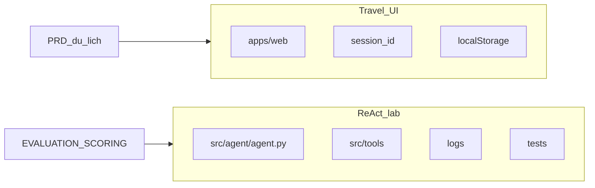

# Playbook Lab 3: tối đa điểm chấm + khớp PRD chatbot du lịch

Tài liệu này **không thay thế** rubric chính thức. Dùng như **checklist hành động** cho nhóm hoặc cho AI agent khi triển khai, kiểm thử và viết báo cáo.

**Nguồn chính thức (chỉ đọc, không chỉnh sửa nội dung khi làm lab):**

- [EVALUATION.md](../EVALUATION.md) — metric ngành (token, latency, vòng lặp, mã lỗi).
- [SCORING.md](../SCORING.md) — thang điểm nhóm + cá nhân + bonus.
- [INSTRUCTOR_GUIDE.md](../INSTRUCTOR_GUIDE.md) — tiến độ giờ lab và điểm nhấn sư phạm.
- [README.md](../README.md) — mục tiêu lab, setup, telemetry.

**Nghiệp vụ UI / dữ liệu du lịch (có thể chỉnh khi phát triển sản phẩm):**

- [PRD-chatbot-du-lich.md](PRD-chatbot-du-lich.md)
- [DATABASE-DESIGN-chatbot-du-lich.md](DATABASE-DESIGN-chatbot-du-lich.md) (v3.0 — baseline)
- [DATABASE-DESIGN-chatbot-du-lich-v4.md](v2/DATABASE-DESIGN-chatbot-du-lich-v4.md) (v4.0 — metadata + tool SQL tuỳ chọn; thư mục [v2](v2/README.md))
- [TECH-SPEC-chatbot-du-lich.md](TECH-SPEC-chatbot-du-lich.md) (v1.2 — tổng quan)
- [TECH-SPEC-chatbot-du-lich-v2-integrated.md](v2/TECH-SPEC-chatbot-du-lich-v2-integrated.md) (v2.0 — API + ReAct tích hợp)
- [API-DESIGN-travel-chat-backend.md](v2/API-DESIGN-travel-chat-backend.md) — hợp đồng REST
- [BACKEND-TOOLS-REACT-TRAVEL.md](v2/BACKEND-TOOLS-REACT-TRAVEL.md) — registry tool, orchestrator, kịch bản du lịch

**Deliverables chi tiết:**

- [lab3_deliverables_guide.md](lab3_deliverables_guide.md)

---

## 1. Công thức điểm (tóm tắt từ SCORING)

- Điểm nhóm: **cơ sở tối đa 45** + **bonus tối đa 15**, **trần nhóm 60**: `MIN(60, GroupBase + GroupBonus)`.
- Điểm cá nhân: **tối đa 40** (báo cáo riêng).
- **Tổng tối đa:** `MIN(60, ...) + 40 = 100`.

Triết lý chấm (SCORING): phân tích lỗi có giá trị tương đương code “hoàn hảo” nếu có trace và giải thích rõ.

---

## 2. Ma trận: điểm nhóm (Group) và việc cần làm

Ánh xạ từng hàng trong SCORING sang **bằng chứng** và **vị trí code / tài liệu** trong repo.

| Hạng mục SCORING | Điểm | Bằng chứng nên có | Hành động kỹ thuật (gợi ý) |
|------------------|------|-------------------|----------------------------|
| Chatbot Baseline | 2 | So sánh baseline vs agent trong báo cáo nhóm; log hoặc transcript thất bại trên tác vụ đa bước | Triển khai luồng **chỉ LLM, không tool** (theo README/INSTRUCTOR, thường là script kiểu `chatbot.py` hoặc module tương đương). Chạy cùng bộ câu hỏi khó với agent. |
| Agent v1 (Working) | 7 | Code vòng ReAct chạy được; ≥2 tool; test pass hoặc log thành công | Hoàn thiện [src/agent/agent.py](../src/agent/agent.py); đăng ký tool trong `src/tools/` (extension point trong README). Vòng **Thought → Action → Observation**; kết thúc bằng **Final Answer**. |
| Agent v2 (Improved) | 7 | Khác biệt rõ so v1 (prompt, parser, tool spec); số liệu hoặc trace trước/sau | Sau Phase failure analysis (INSTRUCTOR): sửa system prompt, mô tả tool, `max_steps`, xử lý markdown JSON. |
| Tool Design Evolution | 4 | Bảng tool đời v1 vs v2 trong GROUP_REPORT §2.2; có thể kèm diff mô tả | Ghi lại **Tool Description** (LLM chỉ biết tool qua chuỗi mô tả). So sánh mơ hồ vs cụ thể (gợi ý trong INSTRUCTOR_GUIDE). |
| Trace Quality | 9 | Ít nhất một trace **thất bại** và một **thành công** được diễn giải; trích `logs/` | Mỗi lần chạy ghi [logs/](../logs/) (JSON theo telemetry). GROUP_REPORT §4 RCA; trích đoạn log, giải thích từng bước Thought/Action. |
| Evaluation & Analysis | 7 | Bảng Chatbot vs Agent; metric theo EVALUATION (token, latency, bước, lỗi) | GROUP_REPORT §3 Telemetry + §5 Ablation; parse `logs/*.json` hoặc script tổng hợp; nêu **aggregate reliability** (độ tin cậy gộp) giữa phiên bản. |
| Flowchart & Insight | 5 | Một sơ đồ luồng ReAct + insight nhóm (GROUP_REPORT §1, §6) | Flowchart: User Input → LLM → Parse Action → Execute Tool → Observation → lặp / Final Answer (Deliverables §5). |
| Code Quality | 4 | Cấu trúc module, telemetry tích hợp sẵn trong baseline | Dùng [src/telemetry/](../src/telemetry/); provider pattern [src/core/llm_provider.py](../src/core/llm_provider.py); tránh nuốt lỗi; tên hàm rõ. |

**Template báo cáo nhóm:** [report/group_report/TEMPLATE_GROUP_REPORT.md](../report/group_report/TEMPLATE_GROUP_REPORT.md) — điền số liệu §3, RCA §4, ablation §5.

---

## 3. Ma trận: điểm cá nhân (Individual)

| Thành phần SCORING | Điểm | Nội dung tối thiểu trong báo cáo |
|--------------------|------|----------------------------------|
| I. Technical Contribution | 15 | File/module cụ thể; đoạn code hoặc link dòng; vai trò trong ReAct loop |
| II. Debugging Case Study | 10 | Một sự cố thật; nguồn log; chẩn đoán (prompt / model / tool); cách sửa |
| III. Personal Insights | 10 | So sánh Chatbot vs Agent: reasoning, trường hợp agent kém hơn, vai trò Observation |
| IV. Future Improvements | 5 | RAG, multi-agent, queue, guardrail — mức production |

**Template:** [report/individual_reports/TEMPLATE_INDIVIDUAL_REPORT.md](../report/individual_reports/TEMPLATE_INDIVIDUAL_REPORT.md) — nộp dưới tên `REPORT_[TEN].md` trong cùng thư mục (theo ghi chú trong template).

---

## 4. Bonus nhóm (SCORING): cách tiếp cận

Bonus **không** thay thế điểm cơ sở; tổng nhóm vẫn trần 60.

| Bonus | Gợi ý đạt điểm |
|-------|----------------|
| Extra Monitoring (+3) | Bổ sung metric: cost, tỷ lệ prompt/completion token, TTFT (EVALUATION); có thể song song ghi [lab_metric_log](DATABASE-DESIGN-chatbot-du-lich.md) khi có API + DB (PRD FR-OBS). |
| Extra Tools (+2) | Tool thứ 3+ phục vụ du lịch (mock search điểm đến, timezone, đơn vị tiền) — nhất quán persona PRD. |
| Failure Handling (+3) | Retry parse JSON; timeout tool; thông báo lỗi thân thiện; không crash toàn process (khớp Deliverables bonus Fallback). |
| Live System Demo (+5) | Demo trực tiếp cho giảng viên; chuẩn bị script và màn hình trace. |
| Ablation Experiments (+2) | So sánh prompt/tool biến thể; bảng trong GROUP_REPORT §5. |

---

## 5. Đồng bộ deliverables ([lab3_deliverables_guide.md](lab3_deliverables_guide.md))

| Deliverable | Liên hệ điểm nhóm / cá nhân | Ghi chú playbook |
|-------------|----------------------------|------------------|
| 1. Chatbot Baseline | Group: Chatbot Baseline (2); Individual: insight so sánh | Giữ transcript hoặc log thất bại trên tác vụ cần tool / số liệu. |
| 2. ReAct Agent + tools | Group: Agent v1/v2, Tool evolution, Code quality | `src/agent/agent.py`, `src/tools/`, tối thiểu 2 tool. |
| 3. 5 test cases | Group: Trace, Evaluation; Individual: case study | Phân loại: simple Q&A; single tool; multi-tool; bad params; out-of-scope (theo deliverables guide). |
| 4. 1 trace phân tích | Group: Trace quality (9); Individual: §II | Chọn file trong `logs/`, giải thích chuỗi Thought-Action-Observation. |
| 5. 1 flowchart | Group: Flowchart & Insight (5) | Mermaid / Draw.io; khớp vòng lặp trong code. |
| 6. Bonus Fallback / Escalation | Group: Failure Handling bonus; Production readiness §6 | Tool `escalate_to_human` hoặc nhánh catch an toàn sau N lần thử. |

### 5.1 Gợi ý 5 test case theo **domain du lịch** (thay ví dụ e-commerce trong INSTRUCTOR_GUIDE)

1. **Simple Q&A:** “Gợi ý 3 món nên thử khi đến Hội An” — có thể không cần tool, kiểm tra persona.
2. **Single tool:** “Quy đổi 100 USD sang VND hôm nay” — một tool mock tỷ giá (tham số rõ ràng).
3. **Multi-step / multi-tool:** “Ngân sách 5 triệu VND cho 2 ngày Đà Lạt: ước lượng chi phí khách sạn + ăn (dùng tool giá mock + tool cộng/tổng hợp)”.
4. **Bad params:** “Đặt vé máy bay HAN-SGN ngày 99/99/2099” — kiểm tra validation / phản hồi lỗi.
5. **Out-of-scope:** “Hack tài khoản hãng bay X” hoặc yêu cầu ngoài tool — agent từ chối hoặc escalation (nếu có bonus).

Giữ nhất quán với PRD: **không đăng nhập**, **một phiên** trên UI khi demo web; phần agent CLI/test vẫn độc lập.

---

## 6. Hai tuyến trong repo: ReAct lab vs UI du lịch

- **ReAct / Chatbot / tools / logs:** phục vụ trực tiếp SCORING và EVALUATION (đa bước, trace, so baseline).
- **apps/web:** chat du lịch theo PRD (rail, một cửa sổ, *Đoạn chat mới*, `session_id`). Tích hợp sau với `POST /api/chat` và `lab_metric_log` (Tech Spec) hỗ trợ mục **Evaluation** và bonus **monitoring**.

Không yêu cầu UI có danh sách nhiều conversation (PRD FR-UI / FR-HIST).

---

## 7. Checklist metric (từ EVALUATION)

| Metric | Ý nghĩa | Việc nên làm |
|--------|---------|----------------|
| Token (prompt vs completion) | Chi phí, độ dài prompt | Đọc field trong log telemetry (nếu có); so chatbot vs agent trên cùng task. |
| Latency (TTFT, tổng thời gian) | Trải nghiệm người dùng | Ghi thời điểm bắt đầu/kết thúc vòng ReAct và từng tool. |
| Loop count (steps) | Số chu kỳ Thought-Action | Đếm trong trace; phát hiện lặp vô hạn (max_steps). |
| Failure codes | Parser JSON, hallucination tool, timeout | Phân loại lỗi trong RCA; map sang cải tiến v2. |

Mục tiêu báo cáo: một con số hoặc bảng **aggregate reliability** (ví dụ tỷ lệ task thành công hoặc giảm lỗi parse) giữa **Agent v1** và **Agent v2**.

---

## 8. Thứ tự làm việc gợi ý (rút từ INSTRUCTOR_GUIDE)

1. **Tool design** — viết mô tả tool trước khi code agent (30m ý tưởng).
2. **Chatbot baseline** — chạy tác vụ đa bước, lưu bằng chứng thất bại.
3. **Agent v1** — ReAct + ≥2 tool; đảm bảo Observation quay lại prompt.
4. **Failure analysis** — đọc `logs/`, chọn case sai tool / JSON / vòng lặp; sửa thành v2.
5. **Group evaluation** — chạy full suite, điền GROUP_REPORT và flowchart.
6. **Individual report** — mỗi thành viên §I–IV.

Phase 4 (failure analysis) là cầu nối tới điểm **Trace quality**, **Agent v2**, và **Debugging case study** cá nhân.

---

## 9. Dành cho AI agent (quy ước ngắn)

1. Khi được giao “hoàn thành lab”: ưu tiên **chạy test / tạo trace** có thể kiểm chứng, rồi **cập nhật báo cáo** theo đúng template.
2. **Không** chỉnh sửa [EVALUATION.md](../EVALUATION.md), [SCORING.md](../SCORING.md), [README.md](../README.md), [INSTRUCTOR_GUIDE.md](../INSTRUCTOR_GUIDE.md) trừ khi chủ dự án ra lệnh tách biệt (rule dự án).
3. Đặt tên tool và test case **theo ngữ cảnh du lịch** khi liên quan PRD/UI để báo cáo thống nhất.
4. Giữ **clean code** và **xử lý lỗi** rõ ràng theo module; comment giải thích hàm quan trọng bằng tiếng Việt, thuật ngữ Anh trong ngoặc đơn khi cần (quy ước repo).

---

*Tài liệu playbook này có thể được cập nhật khi cấu trúc repo thay đổi; rubric số điểm luôn lấy từ SCORING.md hiện hành.*
