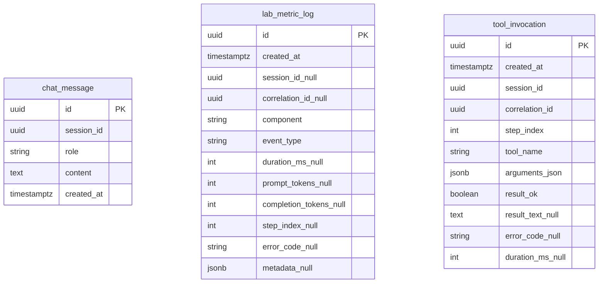

# Database Design — Chat du lịch + ReAct observability (v4)

**Phiên bản:** 4.0  
**RDBMS:** PostgreSQL  
**Schema:** `public`

**Quan hệ với bản cũ:** Tài liệu [DATABASE-DESIGN-chatbot-du-lich.md](../DATABASE-DESIGN-chatbot-du-lich.md) **v3.0 được giữ nguyên** làm baseline tối thiểu (chỉ `chat_message` + `lab_metric_log`). Bản **v4** bổ sung **hợp đồng metadata** và **bảng tuỳ chọn** `tool_invocation` để truy vấn từng lần gọi tool bằng SQL (phục vụ Lab 3 / EVALUATION).

**Căn chỉnh:** [API-DESIGN-travel-chat-backend.md](API-DESIGN-travel-chat-backend.md), [BACKEND-TOOLS-REACT-TRAVEL.md](BACKEND-TOOLS-REACT-TRAVEL.md), [PRD-chatbot-du-lich.md](../PRD-chatbot-du-lich.md).

---

## 1. Bảng giữ nguyên từ v3

### 1.1 `chat_message`

Không đổi ý nghĩa: mỗi dòng là một tin `user` | `assistant` | `system` gắn `session_id`. Xem định nghĩa đầy đủ trong tài liệu v3.0.

### 1.2 `lab_metric_log`

Các cột như v3.0 vẫn hợp lệ. v4 **chuẩn hoá nội dung** cột `metadata` (JSONB) để tooling và báo cáo thống nhất.

---

## 2. Hợp đồng `lab_metric_log.metadata` (JSONB)

Khi `event_type` khác nhau, dùng các key sau (tất cả optional trừ khi ghi chú):

### 2.1 `event_type = llm_call`

```json
{
  "model": "gpt-4o-mini",
  "phase": "react",
  "step_index": 1,
  "finish_reason": "stop"
}
```

### 2.2 `event_type = tool_call` (hoặc gộp trong `react_step`)

```json
{
  "tool_name": "get_exchange_rate",
  "arguments_redacted": { "from_currency": "USD", "to_currency": "VND", "amount": 100 },
  "ok": true,
  "duration_ms": 12
}
```

Lưu ý bảo mật: không lưu PII; có thể hash hoặc cắt ngắn chuỗi dài.

### 2.3 `event_type = parse_error`

```json
{
  "raw_snippet": "first 500 chars…",
  "parser": "json_action_v1"
}
```

### 2.4 `event_type = turn_complete`

```json
{
  "mode": "agent",
  "steps_used": 3,
  "reply_length": 420
}
```

### 2.5 `event_type = escalation`

```json
{
  "tool": "escalate_to_human",
  "reason": "out_of_scope"
}
```

`error_code` trên hàng log vẫn dùng cho `JSON_PARSE`, `UNKNOWN_TOOL`, `MAX_STEPS`, `TOOL_TIMEOUT`, v.v. (khớp EVALUATION).

---

## 3. Bảng tuỳ chọn: `tool_invocation`

**Mục đích:** Một dòng mỗi lần backend thực thi tool trong một lượt `POST /api/chat` với `mode=agent`. Giúp `SELECT` theo `tool_name`, latency, tỷ lệ lỗi mà không cần parse phức tạp JSON trong `lab_metric_log`.

**Khi nào cần:** Nhóm muốn bonus **Extra monitoring** hoặc báo cáo SQL rõ ràng theo tool.

```sql
CREATE TABLE tool_invocation (
  id UUID PRIMARY KEY DEFAULT gen_random_uuid(),
  created_at TIMESTAMPTZ NOT NULL DEFAULT now(),
  session_id UUID NOT NULL,
  correlation_id UUID NOT NULL,
  step_index INTEGER NOT NULL,
  tool_name VARCHAR(64) NOT NULL,
  arguments_json JSONB NOT NULL DEFAULT '{}',
  result_ok BOOLEAN NOT NULL,
  result_text TEXT,
  error_code VARCHAR(64),
  duration_ms INTEGER
);

CREATE INDEX idx_tool_invocation_session ON tool_invocation (session_id, created_at);
CREATE INDEX idx_tool_invocation_tool ON tool_invocation (tool_name, created_at DESC);
```

- **Không bắt buộc FK** tới `chat_message`: liên kết lỏng qua `correlation_id` + thời gian.
- Có thể **bỏ hẳn bảng** và chỉ dùng `lab_metric_log.metadata` nếu lab giữ tối giản.

---

## 4. Sơ đồ ER (v4 đầy đủ tuỳ chọn)



---

## 5. Truy vấn tiêu biểu (bổ sung v4)

```sql
-- Số lần gọi từng tool và tỷ lệ lỗi (7 ngày)
SELECT tool_name,
       COUNT(*) AS n,
       AVG(duration_ms)::int AS avg_ms,
       SUM(CASE WHEN NOT result_ok THEN 1 ELSE 0 END) * 100.0 / COUNT(*) AS err_pct
FROM tool_invocation
WHERE created_at > now() - interval '7 days'
GROUP BY tool_name;
```

```sql
-- Các lượt agent có parse_error (join correlation)
SELECT DISTINCT correlation_id, created_at, metadata
FROM lab_metric_log
WHERE event_type = 'parse_error'
ORDER BY created_at DESC
LIMIT 20;
```

---

## 6. SQLAlchemy / Alembic

- Model thêm: `ToolInvocation` (tuỳ chọn).
- Migration: một revision thêm bảng `tool_invocation`; không thay đổi bảng v3 trừ khi sau này thêm cột nullable.

---

## 7. Lịch phiên bản tài liệu

- **v3.0:** Một luồng chat + `lab_metric_log` (file gốc trong `docs/`).
- **v4.0:** Chuẩn metadata + bảng `tool_invocation` tuỳ chọn cho ReAct / tool analytics (file trong `docs/v2/`).
