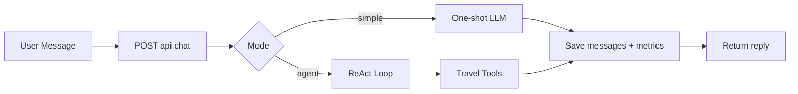

# Master Spec — Backend + AI Agent cho Lab 3

**Phiên bản:** 1.0  
**Mục tiêu:** Tài liệu tổng hợp để triển khai và thuyết trình Lab 3 theo hướng người mới, tập trung vào backend, ReAct agent, tool, đo lường và workflow.

**Tài liệu nền đã có (giữ nguyên):**

- [TECH-SPEC-chatbot-du-lich-v2-integrated.md](TECH-SPEC-chatbot-du-lich-v2-integrated.md)
- [API-DESIGN-travel-chat-backend.md](API-DESIGN-travel-chat-backend.md)
- [BACKEND-TOOLS-REACT-TRAVEL.md](BACKEND-TOOLS-REACT-TRAVEL.md)
- [DATABASE-DESIGN-chatbot-du-lich-v4.md](DATABASE-DESIGN-chatbot-du-lich-v4.md)
- [LAB3_SCORING_DELIVERY_PLAYBOOK.md](../LAB3_SCORING_DELIVERY_PLAYBOOK.md)

---

## 1. Chọn Tech Spec nào để làm chính?

Khi triển khai backend/agent cho Lab 3, lấy:

- **Spec triển khai chính:** `docs/v2/TECH-SPEC-chatbot-du-lich-v2-integrated.md`
- **Spec API chi tiết:** `docs/v2/API-DESIGN-travel-chat-backend.md`
- **Spec AI/Tool chi tiết:** `docs/v2/BACKEND-TOOLS-REACT-TRAVEL.md`
- **Spec DB mở rộng:** `docs/v2/DATABASE-DESIGN-chatbot-du-lich-v4.md`

Bản cũ `docs/TECH-SPEC-chatbot-du-lich.md` và `docs/DATABASE-DESIGN-chatbot-du-lich.md` vẫn dùng làm baseline đối chiếu.

---

## 2. Thiết kế thư mục backend đề xuất

```text
apps/api/
├── app/
│   ├── main.py
│   ├── config.py
│   ├── db.py
│   ├── models/
│   │   ├── chat_message.py
│   │   ├── lab_metric_log.py
│   │   └── tool_invocation.py              # optional
│   ├── schemas/
│   │   ├── chat_request.py
│   │   ├── chat_response.py
│   │   └── error_response.py
│   ├── routers/
│   │   ├── health.py
│   │   └── chat.py
│   ├── services/
│   │   ├── chat_service.py                 # orchestrate simple/agent mode
│   │   ├── react_orchestrator.py           # Thought/Action/Observation loop
│   │   ├── tool_executor.py                # validate + run tool + timeout
│   │   ├── history_service.py              # read/write chat_message
│   │   └── metrics_service.py              # write lab_metric_log/tool_invocation
│   ├── tools/
│   │   ├── registry.py
│   │   ├── schemas.py
│   │   └── travel_tools.py
│   └── providers/
│       └── llm_provider_adapter.py         # OpenAI/Gemini abstraction
├── alembic/
├── alembic.ini
└── README.md
```

---

## 3. Logic backend sẽ sắp xếp như thế nào?

### 3.1 Tầng Router

- Nhận HTTP request (`/api/health`, `/api/chat/history`, `/api/chat`).
- Validate payload bằng Pydantic.
- Không chứa business logic nặng.

### 3.2 Tầng Service

- `chat_service` là cổng vào duy nhất cho một lượt chat.
- Quyết định chạy `simple` (chatbot thường) hay `agent` (ReAct).
- Điều phối lưu lịch sử + gọi LLM + ghi metric.

### 3.3 Tầng AI Orchestrator

- `react_orchestrator` thực thi vòng lặp:
  - Sinh `Thought/Action` từ LLM.
  - Parse action.
  - Gọi tool qua `tool_executor`.
  - Đẩy observation vào context.
  - Lặp đến `Final Answer` hoặc `max_steps`.

### 3.4 Tầng Tool

- `registry` quản lý danh sách tool hợp lệ.
- `tool_executor`:
  - Validate tham số theo schema.
  - Chạy timeout.
  - Chuẩn hóa kết quả về `ToolResult`.

### 3.5 Tầng Persistence/Observability

- `history_service` ghi/đọc `chat_message`.
- `metrics_service` ghi `lab_metric_log` (và `tool_invocation` nếu bật).

---

## 4. Logic chatbot nằm ở đâu?

- **Chatbot baseline** nằm trong nhánh `mode=simple` của `chat_service`.
- Nhánh này:
  1. Nạp history theo `session_id`.
  2. Gọi LLM một lần.
  3. Lưu assistant message.
  4. Ghi metric của lượt gọi.

Mục tiêu là giữ baseline càng đơn giản càng tốt để so sánh công bằng với ReAct agent.

---

## 5. API nào để làm ReAct?

API dùng chung:

- `POST /api/chat` với `mode: "agent"`

Request tối thiểu:

```json
{
  "session_id": "uuid",
  "message": "Ngân sách 5 triệu cho Đà Lạt 2 ngày",
  "mode": "agent",
  "options": { "max_steps": 8 }
}
```

Response gợi ý:

```json
{
  "reply": "...",
  "correlation_id": "uuid",
  "agent": {
    "mode": "agent",
    "steps_used": 3,
    "tools_called": ["estimate_stay_budget", "sum_expenses"]
  },
  "usage": {
    "prompt_tokens": 1000,
    "completion_tokens": 180,
    "total_ms": 3200
  }
}
```

Các API hỗ trợ:

- `GET /api/chat/history?session_id=...`
- `GET /api/health`

---

## 6. Tool cho agent gồm những gì và làm gì?

### 6.1 Bộ tool lõi (đủ để chấm lab)

1. `get_exchange_rate`
   - Quy đổi tiền tệ mock.
   - Dùng cho test single-tool.

2. `estimate_stay_budget`
   - Ước lượng chi phí lưu trú theo thành phố/số đêm/mức tiện nghi.

3. `sum_expenses`
   - Cộng nhiều khoản chi.
   - Tránh sai số do LLM tự nhẩm.

4. `validate_flight_request`
   - Kiểm tra input chuyến bay (IATA/date).
   - Dùng cho test bad params.

5. `search_destination_tips`
   - Trả mẹo du lịch theo city/query (mock dataset).

6. `escalate_to_human` (bonus)
   - Kích hoạt luồng chuyển tiếp hỗ trợ viên (mock).
   - Dùng cho out-of-scope/fallback.

### 6.2 Quy tắc tool bắt buộc

- Mỗi tool có: `name`, `description`, `parameters_schema`, `handler`.
- Chỉ tool trong registry mới được gọi.
- Bắt buộc validate input trước khi chạy handler.

---

## 7. DB cập nhật những bảng nào?

### 7.1 Bắt buộc

1. `chat_message`
   - Lưu toàn bộ lịch sử chat theo `session_id`.

2. `lab_metric_log`
   - Lưu metric và sự kiện:
   - `llm_call`, `tool_call`, `parse_error`, `turn_complete`, `escalation`.
   - Có thể dùng `metadata` để lưu chi tiết linh hoạt.

### 7.2 Tuỳ chọn (khuyến nghị để thuyết trình đẹp)

3. `tool_invocation`
   - Mỗi lần gọi tool là một dòng.
   - Dễ làm báo cáo SQL: tool nào gọi nhiều, lỗi bao nhiêu, latency trung bình.

---

## 8. Lưu số đo, log chứng minh ở đâu?

### 8.1 Lưu ở file (debug nhanh)

- Thư mục `logs/` (JSON events).
- Dùng để trích trace khi thuyết trình.

### 8.2 Lưu ở DB (phân tích/báo cáo)

- `lab_metric_log` cho metric theo event.
- `tool_invocation` cho thống kê tool.

### 8.3 Quy tắc chứng minh

- Mỗi lượt chat có `correlation_id` duy nhất.
- Report phải chỉ ra được:
  - Bảng số đo tổng hợp.
  - Event log/SQL truy ngược theo `correlation_id`.

---

## 9. Làm bảng số đo như thế nào?

### 9.1 Bảng theo test case

| Case | Mode | Success | Steps | Total ms | Prompt tok | Completion tok | Error code |
|------|------|---------|-------|----------|------------|----------------|------------|
| C1 | simple | Yes | 1 | 850 | 320 | 110 | |
| C1 | agent  | Yes | 2 | 1450 | 520 | 140 | |

### 9.2 Bảng tổng hợp v1 vs v2

| Metric | Agent v1 | Agent v2 | Delta |
|--------|----------|----------|-------|
| Success rate | 60% | 85% | +25% |
| Avg steps | 4.8 | 3.1 | -1.7 |
| Parse errors | 7 | 1 | -6 |
| Avg latency | 3800ms | 2900ms | -900ms |

### 9.3 Nguồn dữ liệu

- Từ log file hoặc query SQL trên `lab_metric_log` / `tool_invocation`.
- Luôn ghi chú phạm vi dữ liệu: số case, thời điểm chạy, model sử dụng.

---

## 10. Workflow AI chatbot du lịch (tổng quát đến chi tiết)

### 10.1 Tổng quát



### 10.2 Chi tiết nhánh `agent`

1. Nhận request + validate.
2. Lưu user message vào `chat_message`.
3. Nạp history theo `session_id`.
4. LLM sinh `Thought/Action`.
5. Parse action:
   - Nếu parse lỗi, ghi `parse_error`.
6. Validate và gọi tool:
   - Ghi `tool_call`/`tool_invocation`.
7. Đưa `Observation` vào context.
8. Lặp đến `Final Answer` hoặc `max_steps`.
9. Lưu assistant message + `turn_complete`.
10. Trả response cho frontend.

---

## 11. Dùng API gọi ngoài nào?

### 11.1 Bắt buộc tối thiểu

- **LLM provider API**:
  - OpenAI hoặc Gemini (chọn một làm chính, một làm phụ để demo provider switching).

### 11.2 Tuỳ chọn cho tool du lịch

- Có thể **không cần** gọi API ngoài (dùng mock dataset) để ổn định demo.
- Nếu muốn nâng cấp, chốt nhà cung cấp như sau:
  - **Exchange rate:** `ExchangeRate.host`
  - **Weather:** `Open-Meteo`
  - **Places:** `Foursquare Places`
- Chính sách triển khai khuyến nghị:
  - `mode=mock` trong giai đoạn đầu để demo ổn định.
  - `mode=live` khi bật API ngoài cho từng tool.
  - `mode=auto` (live lỗi thì fallback về mock) để giảm rủi ro khi thuyết trình.

Khuyến nghị cho Lab 3: mock trước, external API sau để giảm rủi ro demo.

---

## 12. Kế hoạch triển khai không-code (để chốt trước khi code)

### 12.1 Sprint 0 — Chốt kiến trúc và phạm vi (0.5 ngày)

1. Chốt **spec nguồn sự thật**:
   - API: `docs/v2/API-DESIGN-travel-chat-backend.md`
   - AI/tool: `docs/v2/BACKEND-TOOLS-REACT-TRAVEL.md`
   - DB: `docs/v2/DATABASE-DESIGN-chatbot-du-lich-v4.md`
2. Chốt chế độ vận hành:
   - Baseline: `mode=simple`
   - Agent: `mode=agent`
   - Tool data source: `mock -> live -> auto fallback`
3. Chốt 5 test case theo domain du lịch (simple, single-tool, multi-tool, bad params, out-of-scope).

**Tiêu chí hoàn thành Sprint 0:** team thống nhất luồng, không còn tranh luận về scope.

### 12.2 Sprint 1 — Thiết kế hợp đồng và cấu trúc thư mục (0.5 ngày)

1. Chốt schema request/response cho:
   - `POST /api/chat`
   - `GET /api/chat/history`
   - `GET /api/health`
2. Chốt cấu trúc `apps/api/app/`:
   - `routers`, `services`, `tools`, `models`, `schemas`
3. Chốt chuẩn lỗi:
   - `VALIDATION_ERROR`, `JSON_PARSE`, `UNKNOWN_TOOL`, `TOOL_TIMEOUT`, `MAX_STEPS`

**Tiêu chí hoàn thành Sprint 1:** có tài liệu API rõ ràng và map module-backend 1-1.

### 12.3 Sprint 2 — Chốt thiết kế tool và external providers (0.5 ngày)

1. Chốt tool bắt buộc:
   - `get_exchange_rate`, `estimate_stay_budget`, `sum_expenses`, `validate_flight_request`, `search_destination_tips`
2. Chốt tool bonus:
   - `escalate_to_human`
3. Chốt external APIs:
   - Exchange rate: `ExchangeRate.host`
   - Weather: `Open-Meteo`
   - Places: `Foursquare Places`
4. Chốt chiến lược fallback:
   - timeout + retry ngắn + fallback mock

**Tiêu chí hoàn thành Sprint 2:** mỗi tool có input schema, output schema, nguồn dữ liệu và fallback policy.

### 12.4 Sprint 3 — Chốt đo lường và chứng minh (0.5 ngày)

1. Chốt metric bắt buộc:
   - token, latency, steps, failure codes
2. Chốt nơi lưu:
   - log file JSON (`logs/`) + DB (`lab_metric_log`, tùy chọn `tool_invocation`)
3. Chốt bảng báo cáo:
   - test-case table
   - v1 vs v2 comparison table
4. Chốt mẫu trace RCA:
   - input -> timeline -> root cause -> fix -> kết quả sau fix

**Tiêu chí hoàn thành Sprint 3:** mọi claim trong report đều truy ngược được về log/SQL.

### 12.5 Sprint 4 — Chốt kế hoạch demo trước giảng viên (0.5 ngày)

1. Chốt kịch bản thuyết trình 5–7 phút:
   - phần baseline
   - phần agent
   - phần trace lỗi và cải tiến v2
2. Chốt artefacts trình chiếu:
   - flowchart
   - 2 bảng số liệu
   - 1 trace thành công + 1 trace lỗi đã sửa
3. Chốt phương án rủi ro:
   - nếu external API lỗi, chạy `mock` hoặc `auto fallback`

**Tiêu chí hoàn thành Sprint 4:** demo chạy trơn trong môi trường local không phụ thuộc internet ổn định.

### 12.6 Definition of Ready (DoR) trước khi code

Chỉ bắt đầu code khi đủ các điều kiện:

1. API contract đã khóa.
2. Tool list + schema + provider đã khóa.
3. Metric/log plan đã khóa.
4. DB plan (v3 tối thiểu hoặc v4 mở rộng) đã chọn.
5. Demo script và report tables đã có khung.

---

## 13. Mốc bàn giao tài liệu

- **M1:** Folder design + API contract + tool list.
- **M2:** DB schema + metric plan + trace template.
- **M3:** Demo script + report table template.

Tài liệu này là bản master để nhóm bám theo khi bắt đầu implement.
