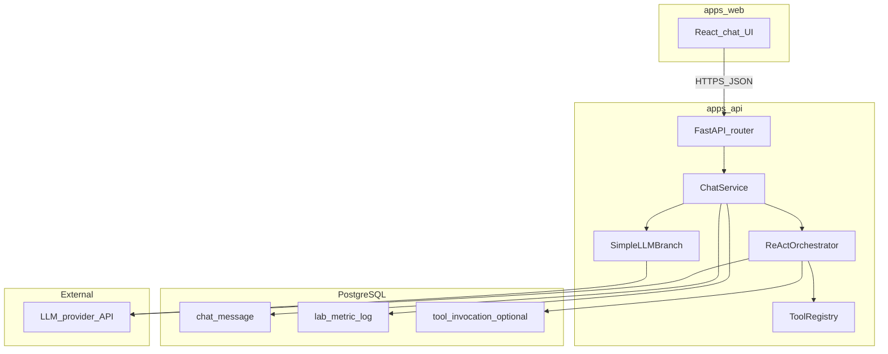

# Tech Spec — Tích hợp backend API + ReAct tool (v2)

**Phiên bản:** 2.0 (tài liệu trong thư mục [docs/v2/](README.md); **không** thay thế [TECH-SPEC-chatbot-du-lich.md](../TECH-SPEC-chatbot-du-lich.md) bản 1.2)  
**PRD:** [PRD-chatbot-du-lich.md](../PRD-chatbot-du-lich.md)  
**API:** [API-DESIGN-travel-chat-backend.md](API-DESIGN-travel-chat-backend.md)  
**Tool / ReAct:** [BACKEND-TOOLS-REACT-TRAVEL.md](BACKEND-TOOLS-REACT-TRAVEL.md)  
**Database:** [DATABASE-DESIGN-chatbot-du-lich-v4.md](DATABASE-DESIGN-chatbot-du-lich-v4.md) (tuỳ chọn nâng từ v3.0)

---

## 1. Mục tiêu kiến trúc v2

- Một service **FastAPI** trong `apps/api` làm **cổng duy nhất** cho `apps/web`: chat đơn và chat agent cùng endpoint `POST /api/chat`.
- **ReAct orchestrator** và **Tool Registry** chạy **in-process** với API (ưu tiên đơn giản lab); tách interface để sau này đưa agent sang worker.
- **PostgreSQL** lưu tin nhắn và (tuỳ chọn) metric / `tool_invocation`.
- Mã lab gốc tại root `src/` vẫn có thể dùng cho CLI và bài tập; **đường hướng** là tái sử dụng `LLMProvider` hoặc copy adapter vào `apps/api`.



---

## 2. Cấu trúc thư mục đề xuất `apps/api`

```
apps/api/
├── app/
│   ├── main.py                 # FastAPI app, CORS, router
│   ├── config.py               # Settings từ env
│   ├── db.py                   # Session / engine SQLAlchemy
│   ├── models/                 # ChatMessage, LabMetricLog, ToolInvocation (optional)
│   ├── schemas/                # Pydantic request/response (khớp API-DESIGN)
│   ├── routers/
│   │   ├── health.py
│   │   └── chat.py
│   ├── services/
│   │   ├── chat_service.py     # Phân nhánh simple vs agent
│   │   ├── react_orchestrator.py
│   │   └── metrics_service.py  # Ghi lab_metric_log (+ tool_invocation)
│   └── tools/
│       ├── registry.py
│       └── travel_tools.py     # get_exchange_rate, ...
├── alembic/
└── alembic.ini
```

---

## 3. Luồng xử lý chính

### 3.1 `POST /api/chat`

1. Router validate body (Pydantic) theo [API-DESIGN-travel-chat-backend.md](API-DESIGN-travel-chat-backend.md).
2. `ChatService.handle_turn(session_id, message, mode, options)`:
   - Persist user message.
   - Load history (giới hạn N tin hoặc token budget).
   - Nếu `simple`: gọi LLM một lần → persist assistant → ghi metric.
   - Nếu `agent`: `ReActOrchestrator.run(...)` theo [BACKEND-TOOLS-REACT-TRAVEL.md](BACKEND-TOOLS-REACT-TRAVEL.md) → persist assistant (Final Answer) → ghi metric từng bước.
3. Trả JSON response đã nêu trong API Design.

### 3.2 Observability

- `component` trong DB: `travel_chat` cho HTTP pipeline; có thể thêm `react_agent` trên từng `llm_call` nếu muốn tách layer trong báo cáo.
- Đồng bộ `correlation_id` xuyên suốt response và mọi hàng log DB.

---

## 4. Biến môi trường (bổ sung)

| Biến | Mô tả |
|------|--------|
| `DATABASE_URL` | Giữ như bản Tech Spec 1.2. |
| `LLM_API_KEY` / provider cụ thể | Khóa gọi OpenAI hoặc Gemini. |
| `DEFAULT_LLM_MODEL` | Model mặc định cho cả simple và agent. |
| `REACT_MAX_STEPS_DEFAULT` | Mặc định 8; có thể override bởi `options.max_steps`. |
| `ENABLE_TOOL_INVOCATION_TABLE` | `true`/`false` — tạo/ghi bảng v4 tuỳ chọn. |
| `CORS_ORIGINS` | Danh sách origin, có `http://localhost:5173`. |

---

## 5. Frontend `apps/web`

- Biến môi trường build: `VITE_API_BASE_URL` trỏ tới API.
- Gửi `session_id` từ `travel_chat_session_id`; `mode` có thể cố định `simple` cho đến khi tích hợp agent xong, sau đó bật `agent` (toggle dev hoặc cấu hình).

---

## 6. Kiểm thử

- Contract test: request/response khớp schema API Design.
- Integration: một phiên `session_id`, 3 tin user, kiểm tra thứ tự history.
- Agent: chạy một prompt single-tool và một prompt multi-tool; kiểm tra dòng trong `lab_metric_log` và (nếu bật) `tool_invocation`.

---

## 7. Mapping PRD và playbook

| Yêu cầu | Cách đáp ứng trong v2 |
|--------|-------------------------|
| Một phiên, không login | `session_id` client + `chat_message`. |
| Đoạn chat mới | Client đổi UUID; server không cần xóa DB cũ (PRD). |
| FR-OBS | `lab_metric_log` + metadata v4; optional `tool_invocation`. |
| Lab 3 scoring / trace | Log đủ bước; export SQL cho GROUP_REPORT. |

---

## 8. Liên kết nhanh

- Tổng quan FE + DB tối thiểu (legacy): [TECH-SPEC-chatbot-du-lich.md](../TECH-SPEC-chatbot-du-lich.md) v1.2  
- Playbook điểm lab: [LAB3_SCORING_DELIVERY_PLAYBOOK.md](../LAB3_SCORING_DELIVERY_PLAYBOOK.md)  
- Mục lục thư mục v2: [README.md](README.md)
